# buaa_ProgrammingAndAlgorithms_TermProject

##基础排序
### 对比图

| 排序种类\数据规模 | 1e5  | 1e6   | 1e7    | 1e8     | 1e9      |
|--------| ---- | ----- | ------ | ------- | -------- |
| 选择排序   | 33ms | 396ms | 4635ms | 53719ms | 594666ms |
| 归并排序   | 11ms | 102ms | 831ms  | 9594ms  | 104291ms |
| 简单快速排序 |      |       |        |         |          |
| 希尔排序   |      |       |        |         |          |
| 基数排序   |      |       |        |         |          |

### 基础排序算法分析

#### 简单选择排序
简单选择排序
基本思想：比较+交换
1. 从待排序序列中，找到关键字最小的元素；
2. 如果最小元素不是待排序序列的第一个元素，将其和第一个元素互换；
3. 从余下的 N - 1 个元素中，找出关键字最小的元素，重复(1)、(2)步，直到排序结束。
   简单选择排序通过两层循环实现。
   第一层循环：依次遍历序列当中的每一个元素
   第二层循环：将遍历得到的当前元素依次与余下的元素进行比较，符合最小元素的条件，则交换。
   
总的时间复杂度为O(n^2)

##### 归并排序
归并排序算法实现排序的思路是：
1. 将整个待排序序列划分成多个不可再分的子序列，每个子序列中仅有 1 个元素；
2. 所有的子序列进行两两合并，合并过程中完成排序操作，最终合并得到的新序列就是有序序列。

举个简单的例子，使用归并排序算法对 {7, 5, 2, 4, 1, 6, 3, 0} 实现升序排序的过程是：
1) 将 {7, 5, 2, 4, 1, 6, 3, 0} 分割成多个子序列，每个子序列中仅包含 1 个元素，分割过程如下所示：
   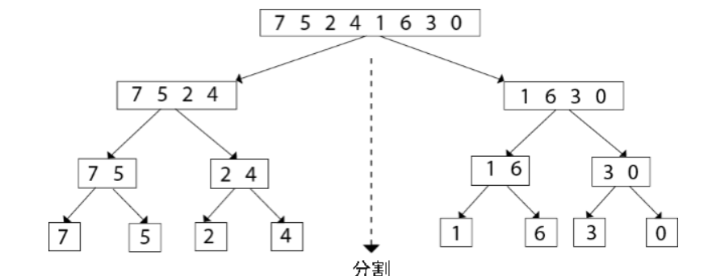
整个序列不断地被一分为二，最终被分割成 {7}、{5}、{2}、{4}、{1}、{6}、{3}、{0} 这几个序列。
2) 将 {7}、{5}、{2}、{4}、{1}、{6}、{3}、{0} 以“两两合并”的方式重新整合为一个有序序列，合并的过程如下图所示：
   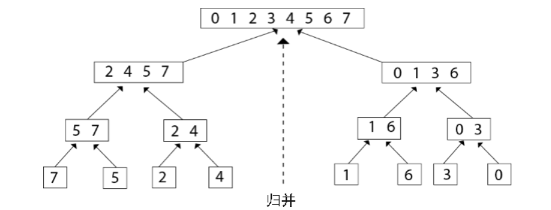

其时间复杂度为
O(nlogn)

#### 快速排序
快速排序是对冒泡排序的一种改进，由 C.A.R.Hoare（Charles Antony Richard Hoare，东尼·霍尔）在 1962 年提出。

快速排序的基本思想是：**通过一趟排序将要排序的数据分割成独立的两部分，其中一部分的所有数据比另一部分的所有数据要小，再按这种方法对这两部分数据分别进行快速排序，整个排序过程可以递归进行，使整个数据变成有序序列。
排序算法的思想非常简单。**
1. 在待排序的数列中，我们首先要找一个数字作为基准数（这只是个专用名词）。为了方便，我们一般选择第 1 个数字作为基准数（其实选择第几个并没有关系）。
2. 接下来我们需要把这个待排序的数列中小于基准数的元素移动到待排序的数列的左边，把大于基准数的元素移动到待排序的数列的右边。这时，左右两个分区的元素就相对有序了；
3. 接着把两个分区的元素分别按照上面两种方法继续对每个分区找出基准数，然后移动，直到各个分区只有一个数时为止。

这是典型的分治思想，即分治法。（先治后分，代码中对简单快速排序有逐行详细解释）

其最好时间复杂度为 O(nlogn) 最坏时间复杂度为 O(n2)
一个例子： 数列 47、29、71、99、78、19、24、47
进行第 1 趟第 1 个交换的排序情况如下
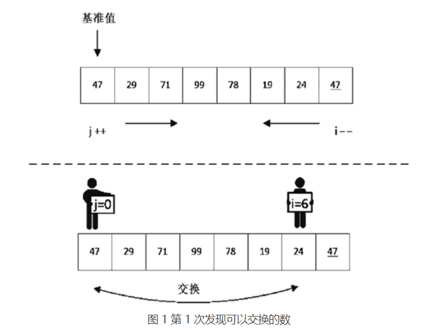
交换之后，j 移动到了下标为 6 的位置，对 i 继续扫描，如图 2 所示
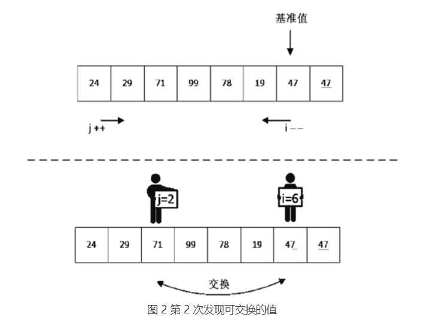
此时交换后的数列变为 24、29、47、99、78、19、71、47。接下来我们继续对 i、j 进行操作，如图 3 所示，继续进行 i-- 及 j++ 的比较操作
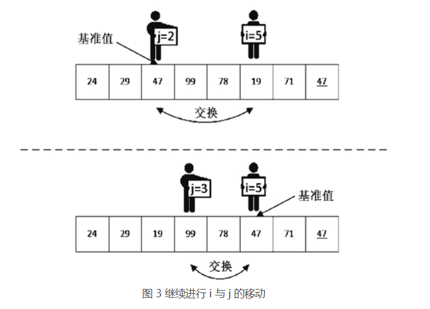

#### 希尔排序
希尔排序(Shell Sort)是插入排序的一种。也称缩小增量排序，是直接插入排序算法的一种更高效的改进版本。
希尔排序，是一种非稳定的更高效的插入排序，在对几乎已经排好序的数据操作时，效率极高，即可以达到线性排序的效率，直接插入排序整体来说是低效的，因为插入排序每次只能将数据移动一位；

希尔排序的基本思想是：先将整个待排序的记录序列分割成为若干子序列分别进行直接插入排序，待整个序列中的记录“基本有序”时，再对全体记录进行依次直接插入排序。

过程如下：

1. 选择一个增量序列 t1，t2，……，tk，其中 ti > tj, tk = 1；

2. 按增量序列个数 k，对序列进行 k 趟排序；

3. 每趟排序，根据对应的增量 ti，将待排序列分割成若干长度为 m 的子序列，分别对各子表进行直接插入排序。仅增量因子为 1 时，整个序列作为一个表来处理，表长度即为整个序列的长度。
最好情况：O(n)
最坏情况：O(n^2)

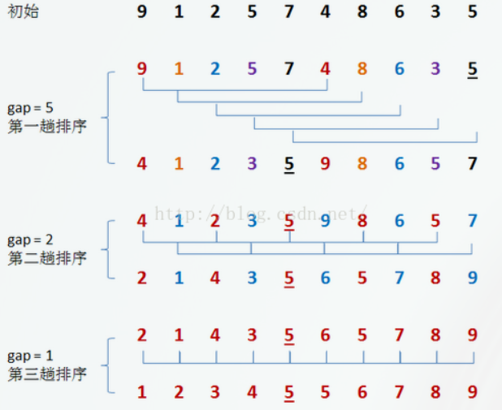

#### 基数排序
基数排序不同于之前所介绍的各类排序，前边介绍到的排序方法或多或少的是通过使用比较和移动记录来实现排序，而基数排序的实现不需要进行对关键字的比较，只需要对关键字进行“分配”与“收集”两种操作即可完成。

例如对无序表{50，123，543，187，49，30，0，2，11，100}进行基数排序，由于每个关键字都是整数数值，且其中的最大值由个位、十位和百位构成，每个数位上的数字从 0 到 9，首先将各个关键字按照其个位数字的不同进行分配分配表如下图所示
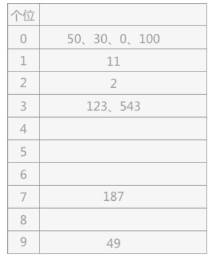
通过按照各关键字的个位数进行分配，按照顺序收集得到的序列变为：{50，30，0，100，11，2，123，543，187，49}。在该序列表的基础上，再按照各关键字的十位对各关键字进行分配，得到的分配表如下图所示：
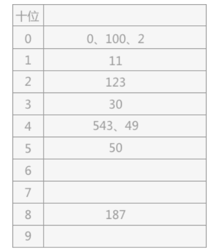
由上表顺序收集得到的记录表为：{0、100、2、11、123、30、543、49、50、187}。在该无序表的基础上，依次将表中的记录按照其关键字的百位进行分配，得到的分配如下图所示：
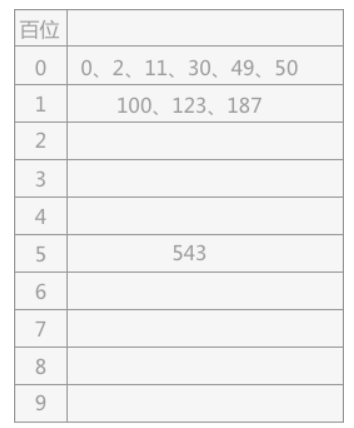
最终通过三次分配与收集，最终得到的就是一个排好序的有序表：{0、2、11、30、49、50、100、123、187、543}。
例子中是按照个位-十位-百位的顺序进行基数排序，此种方式是从最低位开始排序，所以被称为最低位优先法（简称“LSD法”）。
同样还可以按照百位-十位-各位的顺序进行排序，称为最高位优先法（简称“MSD法”）。

## 分布式排序

### 对比图

| 排序种类\数据规模                     | 1e5  | 1e6   | 1e7    | 1e8     | 1e9      |
| ------------------------------------- | ---- | ----- | ------ | ------- | -------- |
| 普通快速排序                          | 33ms | 396ms | 4635ms | 53719ms | 594666ms |
| 无锁分布式快速排序，基于future与async | 11ms | 102ms | 831ms  | 9594ms  | 104291ms |
|                                       |      |       |        |         |          |

### 无锁分布式快速排序

#### 实验结果

- 1e5

  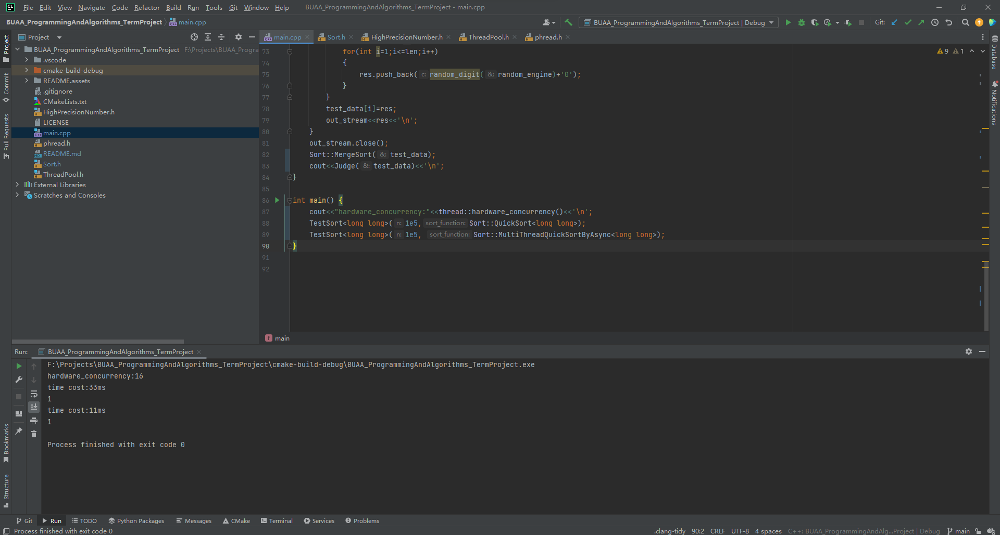

- 1e6

  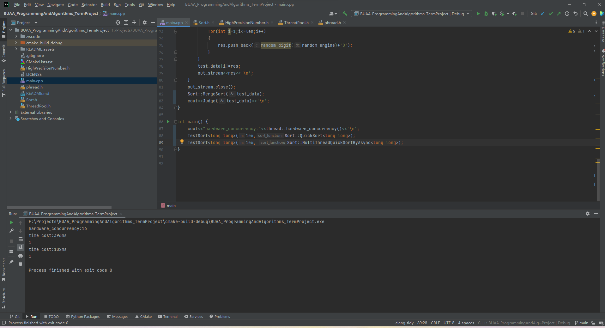

- 1e7

  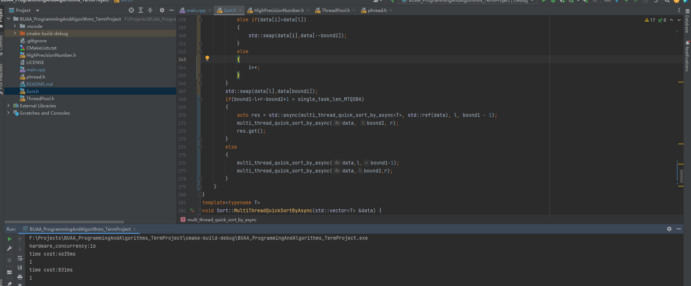

- 1e8

  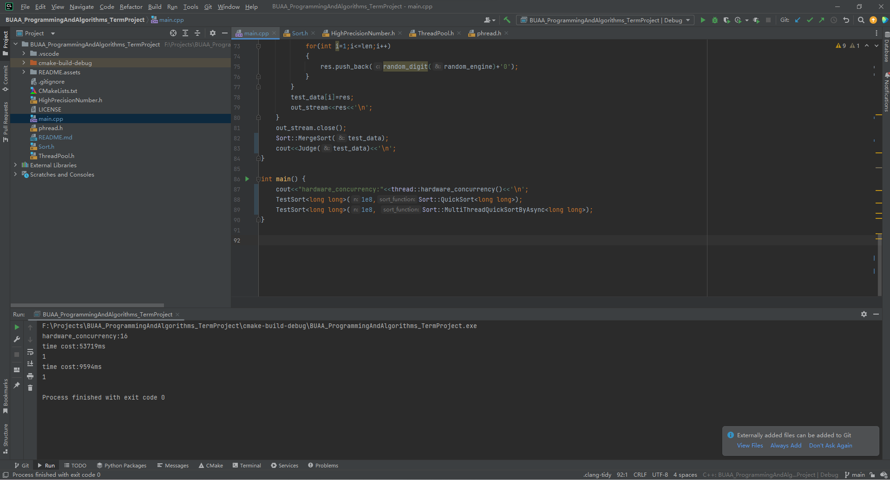

- 1e9

  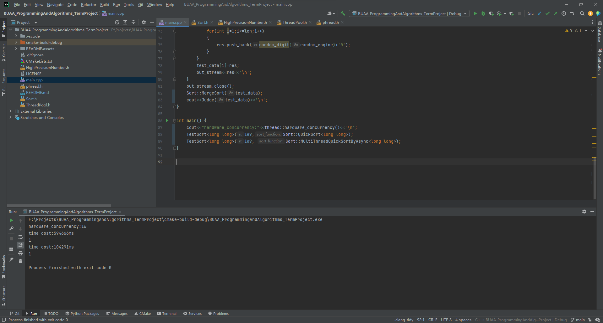
