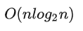

# buaa_ProgrammingAndAlgorithms_TermProject

##基础排序
### 对比图

| 排序种类\数据规模 | 1e5  | 1e6   | 1e7    | 1e8     | 1e9      |
|--------| ---- | ----- | ------ | ------- | -------- |
| 选择排序   | 33ms | 396ms | 4635ms | 53719ms | 594666ms |
| 归并排序   | 11ms | 102ms | 831ms  | 9594ms  | 104291ms |
| 简单快速排序 |      |       |        |         |          |
| 希尔排序   |      |       |        |         |          |
| 基数排序   |      |       |        |         |          |

### 基础排序算法分析

#### 简单选择排序
简单选择排序
基本思想：比较+交换
1. 从待排序序列中，找到关键字最小的元素；
2. 如果最小元素不是待排序序列的第一个元素，将其和第一个元素互换；
3. 从余下的 N - 1 个元素中，找出关键字最小的元素，重复(1)、(2)步，直到排序结束。
   简单选择排序通过两层循环实现。
   第一层循环：依次遍历序列当中的每一个元素
   第二层循环：将遍历得到的当前元素依次与余下的元素进行比较，符合最小元素的条件，则交换。

总的时间复杂度为O(n^2)

##### 归并排序
归并排序算法实现排序的思路是：
1. 将整个待排序序列划分成多个不可再分的子序列，每个子序列中仅有 1 个元素；
2. 所有的子序列进行两两合并，合并过程中完成排序操作，最终合并得到的新序列就是有序序列。

举个简单的例子，使用归并排序算法对 {7, 5, 2, 4, 1, 6, 3, 0} 实现升序排序的过程是：
1) 将 {7, 5, 2, 4, 1, 6, 3, 0} 分割成多个子序列，每个子序列中仅包含 1 个元素，分割过程如下所示：
   
整个序列不断地被一分为二，最终被分割成 {7}、{5}、{2}、{4}、{1}、{6}、{3}、{0} 这几个序列。
2) 将 {7}、{5}、{2}、{4}、{1}、{6}、{3}、{0} 以“两两合并”的方式重新整合为一个有序序列，合并的过程如下图所示：
   

其时间复杂度为

## 分布式排序

### 对比图

| 排序种类\数据规模                     | 1e5  | 1e6   | 1e7    | 1e8     | 1e9      |
| ------------------------------------- | ---- | ----- | ------ | ------- | -------- |
| 普通快速排序                          | 33ms | 396ms | 4635ms | 53719ms | 594666ms |
| 无锁分布式快速排序，基于future与async | 11ms | 102ms | 831ms  | 9594ms  | 104291ms |
|                                       |      |       |        |         |          |

### 无锁分布式快速排序

#### 实验结果

- 1e5

  

- 1e6

  

- 1e7

  

- 1e8

  

- 1e9

  
